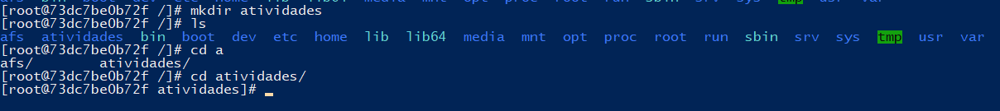

# Relatório de Introdução ao Linux usando Docker no Windows
Nome: Asaph Arruda
Data: 10/05/2025

## Introdução
O objetivo desse exercício foi praticar comandos básicos do Linux dentro de um contêiner Docker usando a imagem do Fedora. A ideia principal era aprender, testar e entender o funcionamento desses comandos em um ambiente controlado.

## Relato

### 1. Iniciar um contâiner Fedora
Inicialmente, utilizando o comando abaixo, nós criamos o container com a imagem do Fedora

```
docker run -it --name fedora-tutorial fedora:latest /bin/bash
```


### 2. Navegação básica
Em seguida, fizemos uma navegação básica pelo terminal:
- Verificamos o diretório atual
```
pwd
```


- Listagem de arquivos
```
ls
```


- Criação de pastas
```
mdkir atividades
```
- Entrar em pastas 
```
cd atividades
```


- Voltar para pastas anteriores
```
cd..
pwd
```


### 3. Manipulação de arquivos
Na etapa seguinte, focamos em fazer a manipulação de arquivos, criar, copiar, mover, e excluir arquivos. Criamos um arquivo.txt, mudamos o nome para: *documento.txt*, fizemos uma cópia para outra pasta, e por fim excluímos o arquivo original.

Em seguida, fizemos uma navegação básica pelo terminal:
- Pasta Home do usuário
```
cd ~
```


- Criando e renomeando um arquivo
```
touch arquivo1.txt
ls
mv arquivo1.txt documento.txt
ls
```

- Entrando no diretório ativividades
```
cd atividades
```

- Criando uma pasta e copiando um arquivo pra ela
```
mkdir backup
cp ~/documento.txt backup/
ls backuo/
```


- Voltando pra home, vendo o caminho e apagando um arquivo

```
cd ~
pwd
rm documento.txt
```


### 4. Gerenciamento de pacotes
Nesta etapa, o foco foi realizar operações de instalação de pacotes. O procedimento foi o seguinte:

1. Atualizamos os pacotes presentes no contâiner


2. Instalamos o editor de texto *nano*


3. Vemos a versão do *nano* instalado


4. Por fim, desinstalamos o *nano*


### 5. Permissões dos arquivos
Neste momento, buscamos compreender como é feito a modificação da permissão dos arquivos. Criamos um arquivo.sh, demos a permissão de execução usando *chmod u+x script.sh*, e por fim verificamos as permissões. Não pude compreender muito bem em relação a termos de execução, quem possui a execução do arquivo ou não.


### 6. Processos em execução
Nesta etapa, buscamos analisar os processos em execução: 
- Listando os processos
- Executando um processo em segundo plano
- Buscando o PID dos processos
- Encerrando


### 7. Encerrando o contâiner
Por fim, finalizamos a atividade saindo, e fechando o contâiner.


### Conclusão
Esse exercício me ajudou a praticar comandos essenciais do Linux e também reforçou meu uso do Docker. Por exemplo, eu nunca tinha usado pwd antes, mesmo tendo alguma experiência com terminal.

Também percebi que o terminal é bem prático, mas ao mesmo tempo, exige atenção. Por exemplo, quando você remove um arquivo com rm, não aparece nenhuma confirmação — só dá pra ver se funcionou com ls.
